# Unit 12 - Credit Risk Classification

## Background

Credit risk poses a classification problem that’s inherently imbalanced. This is because healthy loans easily outnumber risky loans. In this homework, you’ll use various techniques to train and evaluate models with imbalanced classes. You’ll use a dataset of historical lending activity from a peer-to-peer lending services company to build a model that can identify the creditworthiness of borrowers.

Using your knowledge of the imbalanced-learn library, you’ll use a logistic regression model to compare two versions of the dataset. First, you’ll use the original dataset. Second, you’ll resample the data by using the `RandomOverSampler` module from the imbalanced-learn library.

For both cases, you’ll get the count of the target classes, train a logistic regression classifier, calculate the balanced accuracy score, generate a confusion matrix, and generate a classification report.

As part of your GitHub repository’s `README.md` file, you will create a credit risk analysis report based on the template provided in your `Starter_Code` folder.

- - -

## Files

Download the following files to help you get started:

* [Module 12 Homework Files](Instructions/Starter_Code.zip)

- - -

## Instructions

This homework consists of the following subsections:

* Split the Data into Training and Testing Sets

* Create a Logistic Regression Model with the Original Data

* Predict a Logistic Regression Model with Resampled Training Data

* Write a Credit Risk Analysis Report

### Split the Data into Training and Testing Sets

Open the starter code notebook and then use it to complete the following steps.

1. Read the `lending_data.csv` data from the `data` folder into a Pandas DataFrame.
    - Load Credit Data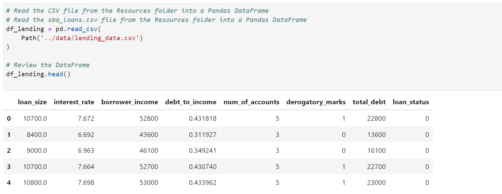

2. Create the labels set (`y`)  from the “loan_status” column, and then create the features (`X`) DataFrame from the remaining columns.
    - Separate X and Y Variables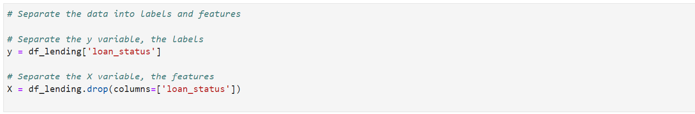
    - Y Variable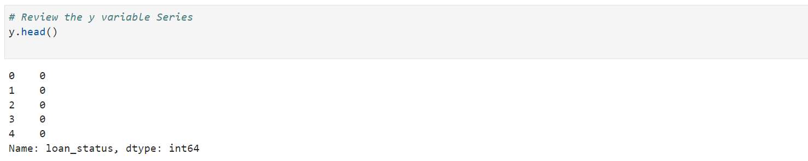
    - X Variables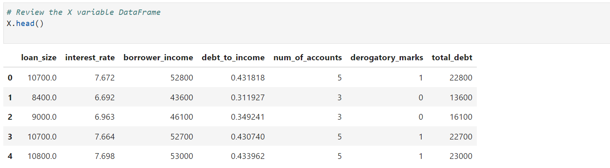

    > **Note** A value of 0 in the “loan_status” column means that the loan is healthy. A value of 1 means that the loan has a high risk of defaulting.

3. Check the balance of the labels variable (`y`) by using the `value_counts` function.
    - Separate X and Y Variables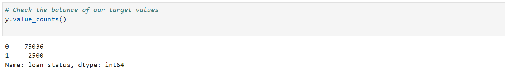
  
    > **Note** The data is imbalanced about 30:1.

4. Split the data into training and testing datasets by using `train_test_split`.
    - Train Test Split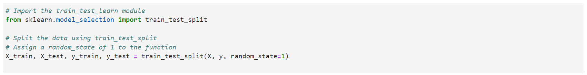
    - Explore Train Test Split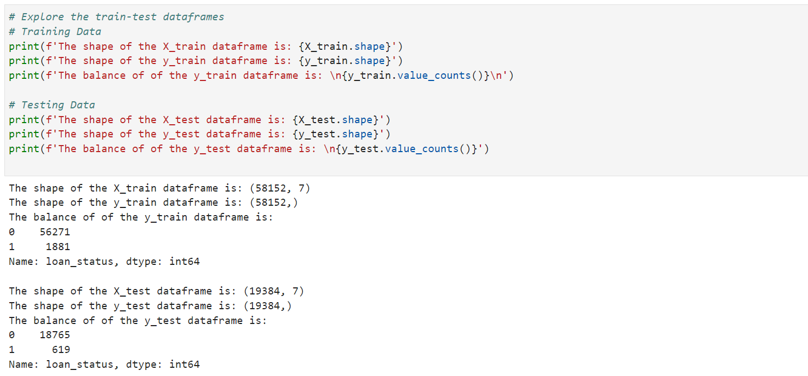

### Create a Logistic Regression Model with the Original Data

Employ your knowledge of logistic regression to complete the following steps:

1. Fit a logistic regression model by using the training data (`X_train` and `y_train`).
    - Logistic Regression Model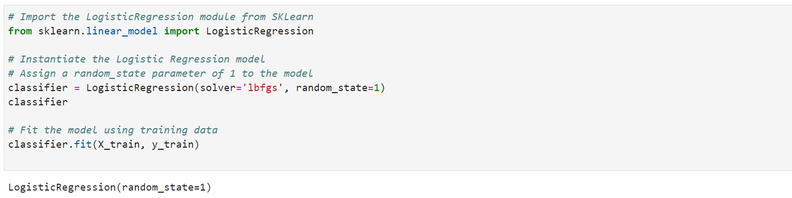

2. Save the predictions on the testing data labels by using the testing feature data (`X_test`) and the fitted model.
    - Predictions from Test Data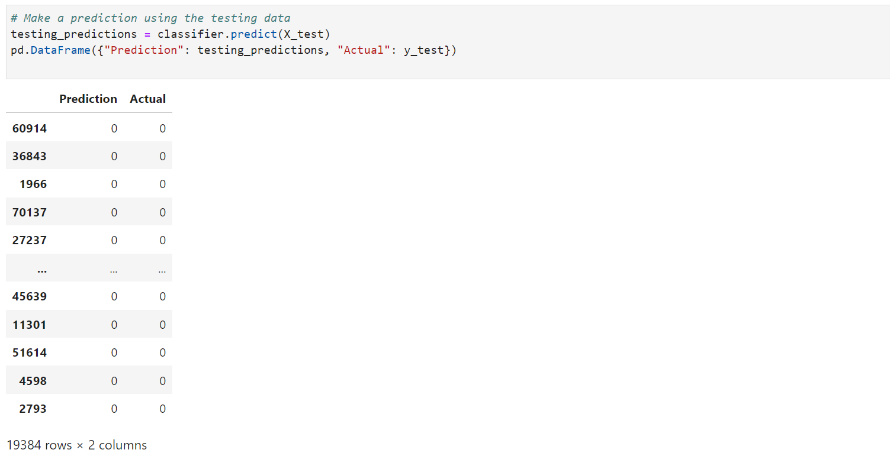

3. Evaluate the model’s performance by doing the following:
    > **Note** It is important to verify that both the training and testing datasets perform at the same level.  
  
    * Calculate the accuracy score of the model.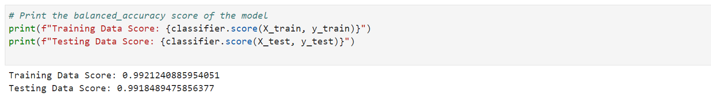

    * Generate a confusion matrix.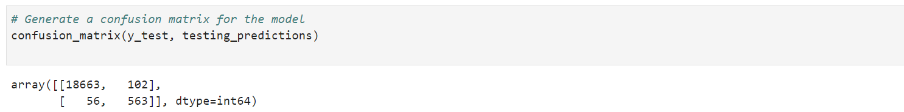

    * Print the classification report.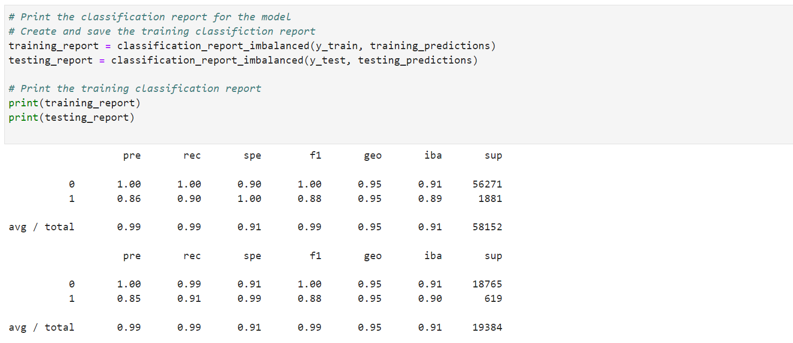
    

4. Answer the following question: How well does the logistic regression model predict both the `0` (healthy loan) and `1` (high-risk loan) labels?
    > **Answer:** The model performs equally well on both the training and test data, this is good. Of greatest concern is rating a high risk loan as low risk which happens 56/619 or 9.0%. The opertunity cost of rating a low risk loan as high risk is very low at 102/1876 or 0.5%.

### Predict a Logistic Regression Model with Resampled Training Data

Did you notice the small number of high-risk loan labels? Perhaps, a model that uses resampled data will perform better. You’ll thus resample the training data and then reevaluate the model. Specifically, you’ll use `RandomOverSampler`.

To do so, complete the following steps:

1. Use the `RandomOverSampler` module from the imbalanced-learn library to resample the data. Be sure to confirm that the labels have an equal number of data points.
    - Random Over Sampler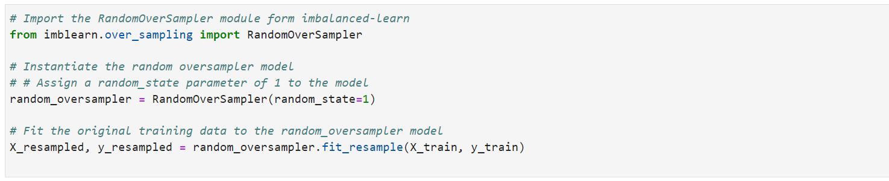
    - Balance Check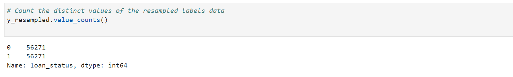
    > **Note** Both resuts have the same number of records.  
  
2. Use the `LogisticRegression` classifier and the resampled data to fit the model and make predictions.
    - Instantiate and Fit Model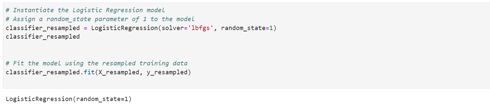  
    - Test Data Predictions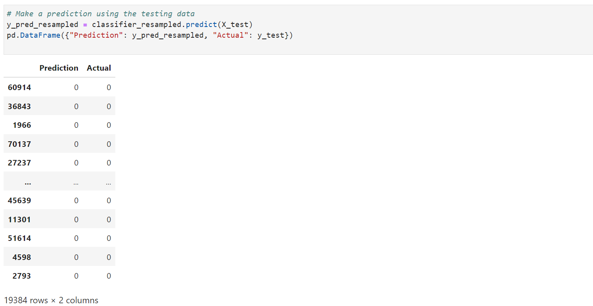  
  
3. Evaluate the model’s performance by doing the following:
    > **Note** It is important to verify that both the training and testing datasets perform at the same level.  
  
    * Calculate the accuracy score of the model.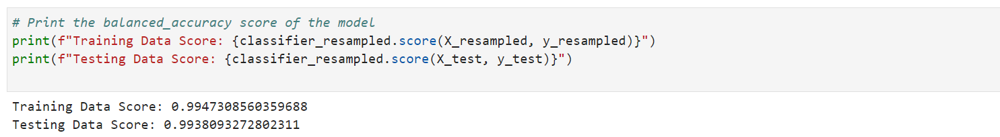

    * Generate a confusion matrix.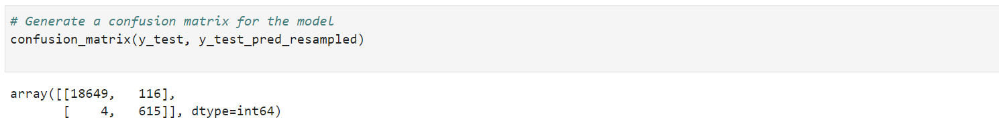

    * Print the classification report.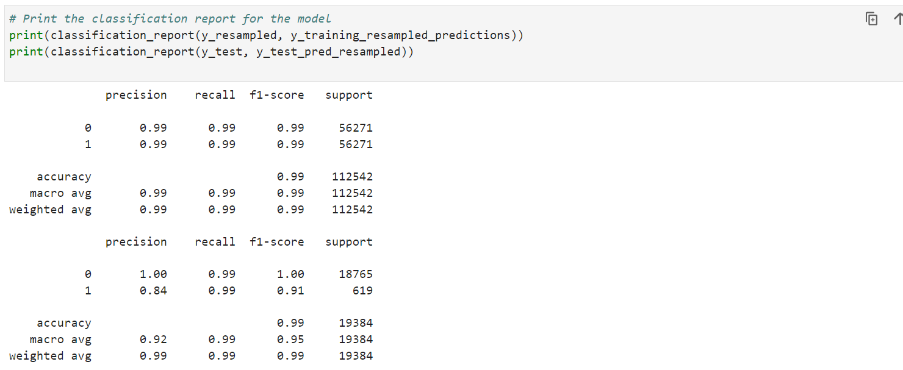

4. Answer the following question: How well does the logistic regression model, fit with oversampled data, predict both the `0` (healthy loan) and `1` (high-risk loan) labels?
    > **Answer:** The model performs equally well on both the training and test data, this is good. Of greatest concern is rating a high risk loan as low risk which happens 4/619 or 0.6%. The opertunity cost of rating a low risk loan as high risk is very low at 116/1876 or 0.6%. The oversampeled model performs much better decreasing false positives by 52 (from 56 to 4) at the small expense of increasing false negatives by 14 (from 102 to 116). 

### Write a Credit Risk Analysis Report

For this section, you’ll write a brief report that includes a summary and an analysis of the performance of both machine learning models that you used in this homework. You should write this report as the `README.md` file included in your GitHub repository.

Structure your report by using the report template that `Starter_Code.zip` includes, and make sure that it contains the following:

1. An overview of the analysis: Explain the purpose of this analysis.

2. The results: Using bulleted lists, describe the balanced accuracy scores and the precision and recall scores of both machine learning models.

3. A summary: Summarize the results from the machine learning models. Compare the two versions of the dataset predictions. Include your recommendation, if any, for the model to use the original vs. the resampled data. If you don’t recommend either model, justify your reasoning.

- - -

### Requirements

#### Split the Data into Training and Testing Sets (20 points)

To receive all points, you must:

* Read the `lending_data.csv` data from the `Resources` folder into a Pandas DataFrame. (5 points)

* Create the labels set (`y`)  from the “loan_status” column, and then create the features (`X`) DataFrame from the remaining columns. (5 points)

* Check the balance of the labels variable (`y`) by using the `value_counts` function. (5 points)

* Split the data into training and testing datasets by using `train_test_split`.  (5 points)

#### Create a Logistic Regression Model with the Original Data (20 points)

To receive all points, you must:

* Fit a logistic regression model by using the training data (`X_train` and `y_train`). (5 points)

* Save the predictions on the testing data labels by using the testing feature data (`X_test`) and the fitted model. (5 points)

* Evaluate the model’s performance by doing the following:

  * Calculate the accuracy score of the model. (2 points)

  * Generate a confusion matrix. (2 points)

  * Print the classification report. (1 points)

  * Answer the following question: How well does the logistic regression model predict both the `0` (healthy loan) and `1` (high-risk loan) labels? (5 points)

#### Predict a Logistic Regression Model with Resampled Training Data (20 points)

To receive all points, you must:

* Use the `RandomOverSampler` module from the imbalanced-learn library to resample the data. (5 points)

* Use the `LogisticRegression` classifier and the resampled data to fit the model and make predictions. (5 points)

* Evaluate the model’s performance by doing the following:
  * Calculate the accuracy score of the model. (2 points)

  * Generate a confusion matrix. (2 points)

  * Print the classification report. (1 points)

  * Answer the following question: How well does the logistic regression model, fit with oversampled data, predict both the `0` (healthy loan) and `1` (high-risk loan) labels?  (5 points)

#### Write a Credit Risk Analysis Report (10 points)

To receive all points, you must:

* Provide an overview that explains the purpose of this analysis. (3 points)

* Using bulleted lists, describe the balanced accuracy scores and the precision and recall scores of both machine learning models. (3 points)

* Summarize the results from the machine learning models. Compare the two versions of the dataset predictions. Include your recommendation, if any, for the model to use the original vs. the resampled data. If you don’t recommend either model, justify your reasoning. (4 points)

#### Coding Conventions and Formatting (10 points)

To receive all points, you must:

* Place imports at the top of the file, just after any module comments and docstrings, and before module globals and constants. (3 points)

* Name functions and variables with lowercase characters, with words separated by underscores. (2 points)

* Follow DRY (Don't Repeat Yourself) principles, creating maintainable and reusable code. (3 points)

* Use concise logic and creative engineering where possible. (2 points)

#### Deployment and Submission (10 points)

To receive all points, you must:

* Submit a link to a GitHub repository that’s cloned to your local machine and that contains your files. (4 points)

* Use the command line to add your files the repository. (3 points)

* Include appropriate commit messages for your files. (3 points)

#### Code Comments (10 points)

To receive all points, your code must:

* Be well commented with concise, relevant notes that other developers can understand. (10 points)

### Submission

* Submit a link to a GitHub repository that’s cloned to your local machine and contains your files.

* Make sure to include appropriate commit messages in your files.

- - -

© 2022 edX Boot Camps LLC. Confidential and Proprietary. All Rights Reserved.
