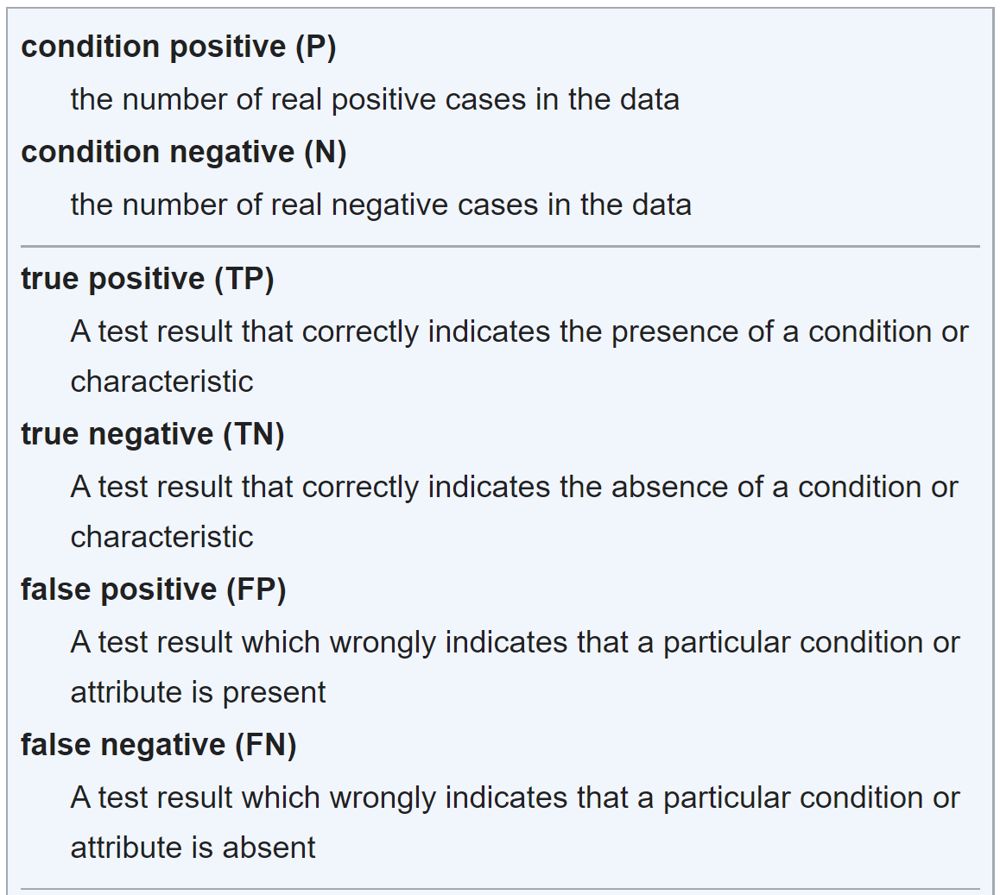
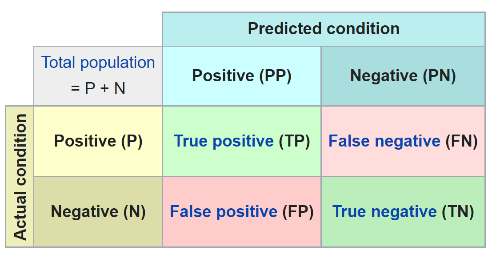
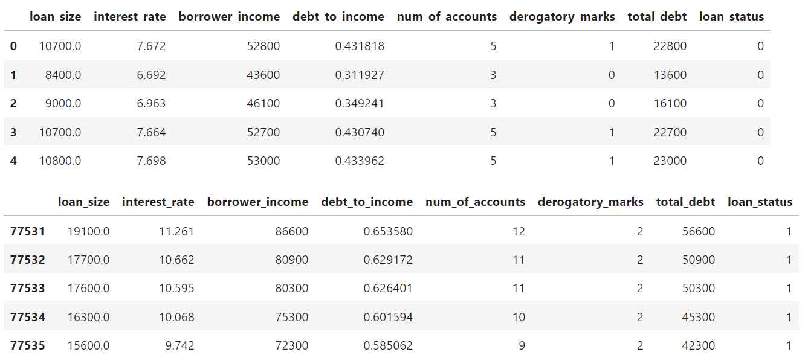
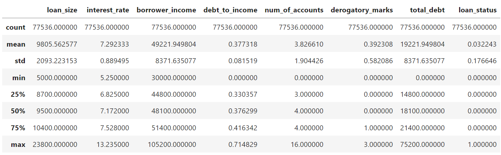
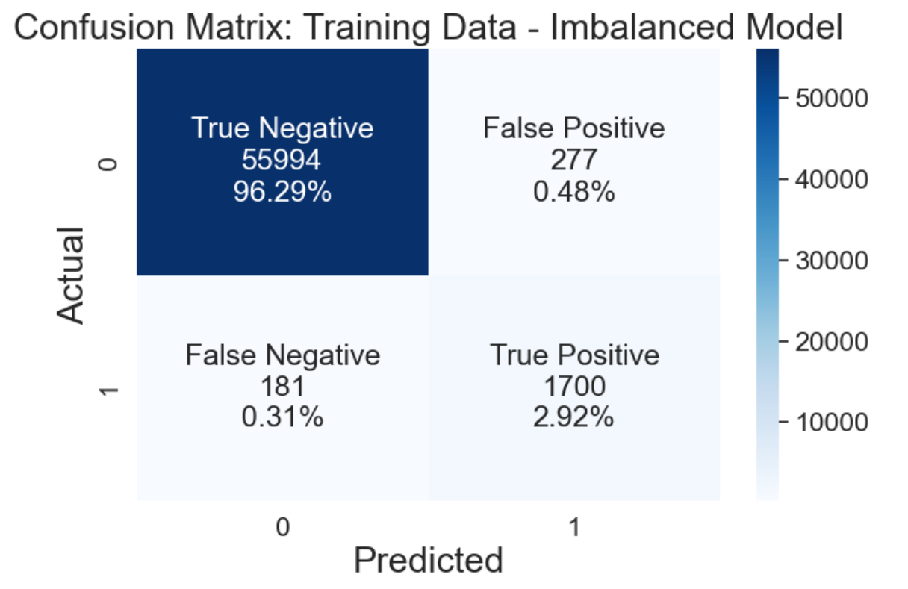
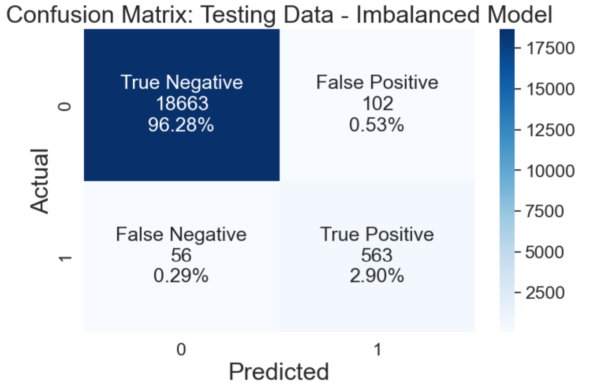
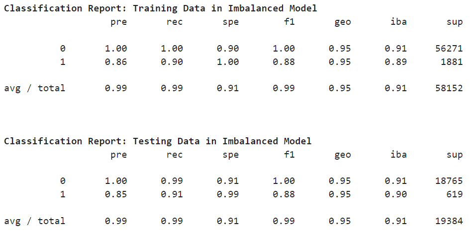
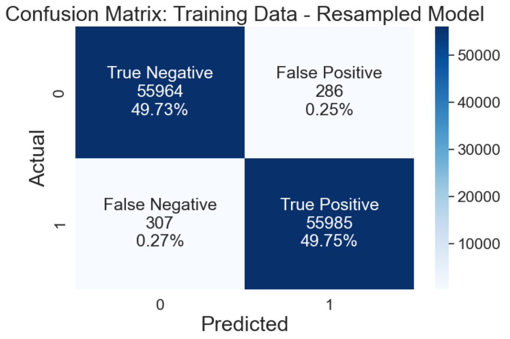
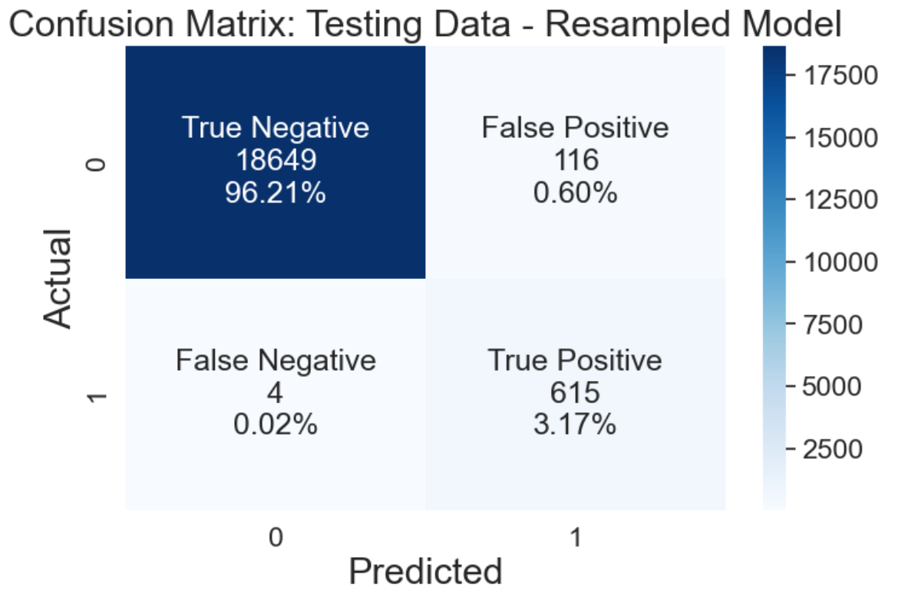
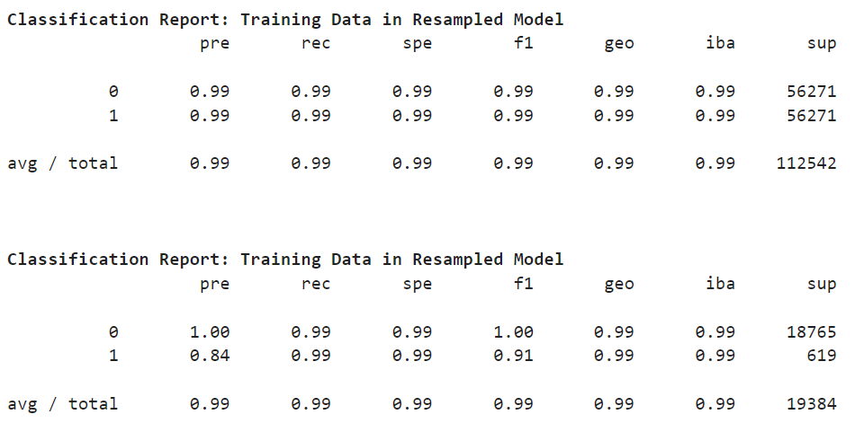

# Unit 12 - Credit Risk Classification

---
## Document Contents
### 1. Credit Risk Classification Report
* [Credit Risk Classification Report (Only)](Credit_Risk_Analysis_Report.md)
### 2. Project Background
* [Instruction Details](Instructions/README.md)
### 3. Project Process and Results
* [Jupyter Notebook](code/credit_risk_resampling.ipynb)
* [Credit Risk Data csv file](data/lending_data.csv)  
    * Note: csv file is to large for github - will zip in the future
&nbsp;  
&nbsp;  
---

# 1. CREDIT RISK CLASSIFICATION REPORT

## Overview of the Analysis

In this section, describe the analysis you completed for the machine learning models used in this Challenge. This might include:

### Purpose
* To build a model that can idetify the credit worthiness of borrowers. That is, given a number of variables, is the customer expected to pay the poan back. 

&nbsp;  

### Data Provided
* The datset included 7 Feature variables are used to make a prediction:  
    | Variable | Minimun | Mean | Maximum |  
    | ---------- | ------- | ---- | ------- |  
    | Loan Size | $5.0K | $9.8K | $23.8K |  
    | Interest Rate | 5.25% | 7.29% | 13.23% |  
    | Borrower Income | $30.0K | $49.2K | $105.2K |  
    | Debt to Income Ratio | 0.00 | 0.37 | 0.71 |  
    | Number of Accounts | 0.0 | 3.8 | 16.0 |  
    | Derogatory Remarks | 0.0 | 0.4 | 3.0 |
> See Appendix 1 for sample data and summary statistics 
 
&nbsp;  

### Target Variable
* The target variable represets weather the loan was paid or defaulted (Paid = 0, Default = 2)  
* This dataset is imbalanced because only 3.2% represent the default category
    | Variable | Paid | Default | Total | Percent Default |  
    | ---------- | ---- | ------- | ----- | --------------- |    
    | Loan Data | 75,036 | 2,500 | 77,536 | 3.2% |     

&nbsp;  

### Modeling Process
* Supervised Machine Learing (ML) Clasification methodology.  
  * Supervised ML algorythms are provided both predictors and answers to create the model
  * Classifaction means that the ML program is will classify the feature combinations into 1 of the 2 answers Paid (0) or Default (1)  
* Data Preparation: The dataset is divided into a training dataset (70%) and testing datset (30%)
  * Data leakage occurs when answers are included in when training the model. 
  * This can lead to a percerved better result than will be experianced in production
  * Train/Test split ia an approach the mitigates data leakage
* Train: The model is trained on the training dataset (70% of the records)
* Test: The model is tested on the testing dataset (30% of the records)
* Evaluate: The model is evaluated on its accuracy at predicting both Paid (0) and Default (1)
  * False Negative: Someone who whould have paid their loan is denied because the model expects them to default. The lost opertunity cost of the interest from the loan might be considerd to be a more desireable error due to its small magnitude.
  * False Positive: Someone who is offered a loan becuase the model expects them to pay but they default. The loan loss might be considered a less desirable error due to its large magnitude.
  
* Out of Scope: 
   * Furter evluation of the model comparing expected opertunity cost to expeted loan loss.
   * Feature engineering to develop additional variable to enhance the model
> See Apendix A for more on model evaluation 

&nbsp;    
  
### Modeling Methods
* The model will use `LogisticRegression` method that:
  * Calculates the probability (a decimal between 0 and 1) of default
  * Results of 0.5 or lower are assigned 0 or paid
  * Results of 0.5 or higher are assigned 1 or default
* The data is imbalanced:
  * Machine Learning Model 1 will use the imbalanced data as is 
  * Machine Learning Model 2 will use over sampaling that creates new Default records so there is the same number as the Pad records
  
&nbsp;  
  
## Results
* Interpreting the Results
  * Predicting Defaults(1) is Positive(P) 
  * Predicting Paid(0) is Negative(N)  
  
&nbsp;  
  
* Machine Learning Model 1:
  * Logistic Regression Model from Imbalanced data 
  * Accuracy: 99% (158 Detaults and Paids predicted incorrectly on 19,384)
  * Precision: 84% (563 Defaults were predicted correctly of 665 Defaults predicted)
  * Recall: 90% (563 Defaults were predicted correctly of 619 actual Defualts in the dataset)  
  
    | Model 1 | Dataset | Target Variable | Accuracy | Precision | Recall | Specificity | Support |  
    | ------- | ------- | --------------- | -------- | --------- | ------ | ----------- | ------- |  
    | Loan Data | Train | Paid (0) | 1.00 | 1.00 | 1.00 | 0.90 | 56,271 |     
    |  |  | Default (1) | 0.88 | 0.86 | 0.90 | 1.00 | 1,881 |  
    |  | Test | Paid (0) | 1.00 | 1.00 | 0.99 | 0.91 | 18,765 |     
    |  |  | Default (1) | 0.88 | 0.85 | 0.91 | 0.99 | 619 |  
> See Appendix 2 for Model 1 Outputs 

&nbsp;  
* Machine Learning Model 2:
  * Logistic Regression Model with Oversampling to correct for Imbalanced data 
  * Accuracy: 100% (120 Detaults and Paids predicted incorrectly on 19,384)
  * Precision: 85% (615 Defaults were predicted correctly of 731 Defaults predicted)
  * Recall: 90% (615 Defaults were predicted correctly of 619 actual Defualts in the dataset)  

    | Model 2 | Dataset | Target Variable | Accuracy | Precision | Recall | Specificity | Support |  
    | ------- | ------- | --------------- | -------- | --------- | ------ | ----------- | ------- |  
    | Resampled | Train | Paid (0) | 0.99 | 0.99 | 0.99 | 0.99 | 56,271 |     
    |  |  | Default (1) | 0.99 | 0.99 | 0.99 | 0.99 | 56,271 |  
    |  | Test | Paid (0) | 1.00 | 1.00 | 0.99 | 0.99 | 18,765 |     
    |  |  | Default (1) | 0.91 | 0.84 | 0.91 | 0.99 | 619 |  
> See Appendix 2 for Model 1 Outputs 
&nbsp;  

## Summary
Both models performed well, however, Model 2 is recomeded because it performed the best:
* Assumption: The cost of a defauled loan far exceeds the revenue from a performining loan. 
  * This means it is preferable to have fewer false predections of default than of performance.
* The change in performance can be charaterised as the benefit of the reduction in incorrect preductions of performance for loans that defaulted (from 56 to 4) exceeds the cost of rejection more loans that woul perform (from 102 to 116). 
  * That is forgoing 14 loans that would perform is better then taking on 52 loans that would default.
* Imbalanced Data Problem: 
  * A simple model, give loans to everyone, would yield a 97% accuracy rate. (619 Defaults)
    * This could cost \$3.0M (\$9,805 (mean loan size) x 50% (default cost) x 619 (loans) = \$3.0M) 
  * Using logistic regression model improved the error rates significantly. (158 - 56 Defaults and 102 Rejections)
    * This could cost only \$0.639M (\$9,805 (mean loan size) x 50% (default cost) x 56 (loans) = \$374K) + ((\$9,805 (mean loan size) x 7.29% (average interest rate) x 5 (loans term) x 102 (loans) = \$365K))
  * Appling data balancing techeniques further improved the model. (120 - 4 Defaults and 116 Rejections)  
    * This could cost only \$0.434M (\$9,805 (mean loan size) x 50% (default cost) x 4 (loans) = \$19K) + ((\$9,805 (mean loan size) x 7.29% (average interest rate) x 5 (loans term) x 116 (loans) = \$415K))
* Next Steps:
  * Validate cost savings assumtions 
  * Apply additional feature engineering
  * Explore additioal classification modeling techniques like decision trees 

&nbsp;  

---
## Appendix
---
&nbsp;  
### Appendix A - Definitions
&nbsp;  
#### 1. Confusion Matrix
- Reference: Wikipedia - https://en.wikipedia.org/wiki/
- Terminology  
- Confusion Matrix (2x2)  
  
- Recall: True Positive Rate  
      - Percent of Positives that were predicted correctly  
      - TPR = TP/P = (TP)/(TP + FN)  
      - Sensitivity, Hit Rate  
- Specificity: True Negative Rate
      - Percent of Negatives that were predicted correctly  
      - TNR = TN/N = (TN)/(TN + FP)  
      - selectivity
- Precision: Positive Predictive Value
      - Percent of Positive predictions that were correct
      - PPV = (TP)/(TP + FP)
- F1 Score: Accuracy
      - Percent of times the model predicted correctly (P or N)
      - Combines Precision and Recall
      - Designed for imbalanced data
      - F1 = (2 x Precision x Recall)/(Precision + Recall)

&nbsp;  
#### 2. iblearn metrics classification report imbalanced
  - pre - Precision: Positive Predictive Value
  - rec - Recall: True Positive Rate
  - spe - Specificity: True Negative Rate
  - f1 - F1 Score: Accuracy
  - geo - Geomectric Mean:
  - iba - Index Balanced Accuracy: 

&nbsp;  
### Appendix 1 - Data Provided
- Data Provided (First and Last 5 rows)  
- Summary Statistics  

&nbsp;  
### Appendix 2 - Model 1 - Logistic Regression - Imbalanced Data
- Confusion Matrix - Training Data  
- Confusion Matrix - Testing Data  
- Classifcation Reports  

&nbsp;  
### Appendix 3 - Model 2 - Logistic Regression - Resampling to Correct for Imbalanced Data
- Confusion Matrix - Training Data  
- Confusion Matrix - Testing Data  
- Classifcation Reports  

&nbsp;  

&nbsp;  

&nbsp;  

---
# 2. Background

Credit risk poses a classification problem that’s inherently imbalanced. This is because healthy loans easily outnumber risky loans. In this homework, you’ll use various techniques to train and evaluate models with imbalanced classes. You’ll use a dataset of historical lending activity from a peer-to-peer lending services company to build a model that can identify the creditworthiness of borrowers.

Using your knowledge of the imbalanced-learn library, you’ll use a logistic regression model to compare two versions of the dataset. First, you’ll use the original dataset. Second, you’ll resample the data by using the `RandomOverSampler` module from the imbalanced-learn library.

For both cases, you’ll get the count of the target classes, train a logistic regression classifier, calculate the balanced accuracy score, generate a confusion matrix, and generate a classification report.

As part of your GitHub repository’s `README.md` file, you will create a credit risk analysis report based on the template provided in your `Starter_Code` folder.

&nbsp;  

&nbsp;  

&nbsp;  

- - -

# 3. Project Process and Results

This project consists of the following subsections:

* Split the Data into Training and Testing Sets

* Create a Logistic Regression Model with the Original Data

* Predict a Logistic Regression Model with Resampled Training Data

* Write a Credit Risk Analysis Report

### Split the Data into Training and Testing Sets

Open the starter code notebook and then use it to complete the following steps.

1. Read the `lending_data.csv` data from the `data` folder into a Pandas DataFrame.
    - Load Credit Data
    - Summary Statistics

2. Create the labels set (`y`)  from the “loan_status” column, and then create the features (`X`) DataFrame from the remaining columns.
    - Separate X and Y Variables
    - Y Variable
    - X Variables

    > **Note** A value of 0 in the “loan_status” column means that the loan is healthy. A value of 1 means that the loan has a high risk of defaulting.

3. Check the balance of the labels variable (`y`) by using the `value_counts` function.
    - Separate X and Y Variables
  
    > **Note** The data is imbalanced about 30:1.

4. Split the data into training and testing datasets by using `train_test_split`.
    - Train Test Split
    - Explore Train Test Split

### Create a Logistic Regression Model with the Original Data

Employ your knowledge of logistic regression to complete the following steps:

1. Fit a logistic regression model by using the training data (`X_train` and `y_train`).
    - Logistic Regression Model

2. Save the predictions on the testing data labels by using the testing feature data (`X_test`) and the fitted model.
    - Predictions from Test Data

3. Evaluate the model’s performance by doing the following:
    > **Note** It is important to verify that both the training and testing datasets perform at the same level.  
  
    * Calculate the accuracy score of the model.

    * Generate a confusion matrix.

    * Print the classification report.
    

4. Answer the following question: How well does the logistic regression model predict both the `0` (healthy loan) and `1` (high-risk loan) labels?
    > **Answer:** The model performs equally well on both the training and test data, this is good. Of greatest concern is rating a high risk loan as low risk which happens 56/619 or 9.0%. The opertunity cost of rating a low risk loan as high risk is very low at 102/1876 or 0.5%.

### Predict a Logistic Regression Model with Resampled Training Data

Did you notice the small number of high-risk loan labels? Perhaps, a model that uses resampled data will perform better. You’ll thus resample the training data and then reevaluate the model. Specifically, you’ll use `RandomOverSampler`.

To do so, complete the following steps:

1. Use the `RandomOverSampler` module from the imbalanced-learn library to resample the data. Be sure to confirm that the labels have an equal number of data points.
    - Random Over Sampler
    - Balance Check
    > **Note** Both resuts have the same number of records.  
  
2. Use the `LogisticRegression` classifier and the resampled data to fit the model and make predictions.
    - Instantiate and Fit Model  
    - Test Data Predictions  
  
3. Evaluate the model’s performance by doing the following:
    > **Note** It is important to verify that both the training and testing datasets perform at the same level.  
  
    * Calculate the accuracy score of the model.

    * Generate a confusion matrix.

    * Print the classification report.

4. Answer the following question: How well does the logistic regression model, fit with oversampled data, predict both the `0` (healthy loan) and `1` (high-risk loan) labels?
    > **Answer:** The model performs equally well on both the training and test data, this is good. Of greatest concern is rating a high risk loan as low risk which happens 4/619 or 0.6%. The opertunity cost of rating a low risk loan as high risk is very low at 116/1876 or 0.6%. The oversampeled model performs much better decreasing false positives by 52 (from 56 to 4) at the small expense of increasing false negatives by 14 (from 102 to 116). 

- - -

© 2022 edX Boot Camps LLC. Confidential and Proprietary. All Rights Reserved.
